# Gamma

Gamma is a distributed video processing platform (a Mux-like) designed to handle video ingestion, processing, and delivery.


## How to start

### Prerequisites
- Docker & Docker Compose
- Go 1.23+
- Node.js & pnpm (for the dashboard)

### Quick Start

1. **Start Infrastructure** (PostgreSQL, NATS, MinIO):
   ```bash
   make docker-up
   ```

2. **Run Migrations**:
   ```bash
   make migrate-up
   ```

3. **Run Services** (in separate terminals):
   ```bash
   make run-api
   make run-worker
   ```

4. **Start Dashboard**:
   ```bash
   make dashboard-start
   ```
   Access the dashboard at `http://localhost:4200`.

## How does it work?

```mermaid
---
config:
  theme: dark
  themeVariables:
    edgeLabelBackground: '#121212'
    edgeLabelColor: '#ffffff'
---
flowchart TB
    subgraph Client ["Client Side"]
        direction TB
        User["👤 User"] -- Uses --> Dashboard["💻 Dashboard<br>(Angular)"]
    end

    Dashboard -- "1. Request Upload URL" --> API["⚙️ API Service<br>(Go)"]
    API -- "2. Create Pending Record" --> DB[("🐘 PostgreSQL<br>(Database)")]
    API -- "3. Return Presigned URL" --> Dashboard
    Dashboard -- "4. Direct Upload" --> MinIO[("🗄️ MinIO<br>(S3 Storage)")]
    MinIO -. "5. Event: Uploaded" .-> NATS["📨 NATS<br>(JetStream)"]
    
    subgraph WorkerPool ["⚡ Scalable Worker Pool"]
        direction LR
        Worker["🛠️ Worker 1<br>(Go)"]
        Worker2["🛠️ Worker 2..N<br>(Go)"]
    end

    NATS -- "6. Consume Job" --> Worker
    NATS -.- Worker2

    Worker <-- "7. Process with FFmpeg" --> MinIO
    Worker -- "8. Upload HLS" --> MinIO
    Worker -- "9. Update Status" --> DB
    Worker -- "10. Event: Processed" --> NATS
    NATS -- "11. Notify" --> API
    API -- "12. WebSocket Msg" --> Dashboard

     User:::user
     Dashboard:::angular
     API:::go
     Worker:::go
     Worker2:::go
     MinIO:::storage
     NATS:::messaging
     DB:::db

     style WorkerPool fill:transparent,stroke:#00bcd4,stroke-width:2px,stroke-dasharray: 5 5,color:#fff
     style Client fill:transparent,stroke:#90a4ae,stroke-width:2px,stroke-dasharray: 5 5,color:#fff
    
    classDef user fill:#37474f,stroke:#90a4ae,stroke-width:2px,color:#fff
    classDef angular fill:#880e4f,stroke:#f50057,stroke-width:2px,color:#fff
    classDef go fill:#006064,stroke:#00bcd4,stroke-width:2px,color:#fff
    classDef storage fill:#b71c1c,stroke:#ff5252,stroke-width:2px,color:#fff
    classDef messaging fill:#1b5e20,stroke:#66bb6a,stroke-width:2px,color:#fff
    classDef db fill:#1a237e,stroke:#7986cb,stroke-width:2px,color:#fff
```



Gamma is built using a microservices architecture:

### Microservices
- **API (`cmd/api`)**: Handles HTTP requests, file uploads, and serves data to the frontend.
- **Worker (`cmd/worker`)**: Consumes jobs from NATS to process videos (transcoding, etc.) asynchronously.

### Technologies
- **Backend**: Go
- **Frontend**: Angular
- **Database**: PostgreSQL
- **Messaging**: NATS
- **Storage**: S3-compatible object storage (MinIO for local development)

## Roadmap

### Implemented
- Basic video ingestion and upload flow
- Asynchronous worker processing
- Basic Dashboard UI
- Multi-quality transcoding (ABR)

### To Do
See [ISSUES.md](ISSUES.md) for the full roadmap and todo list.